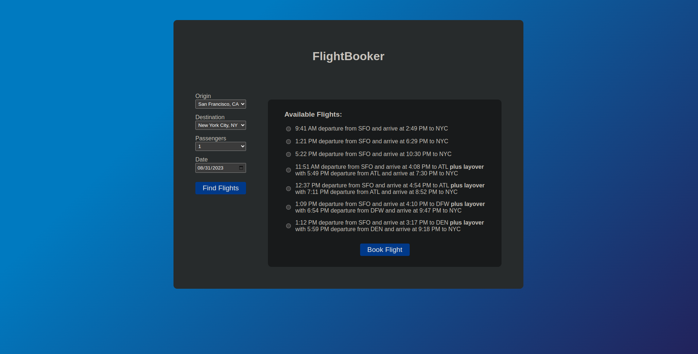
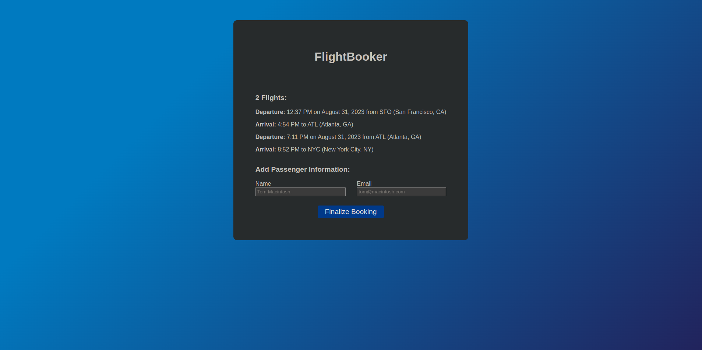
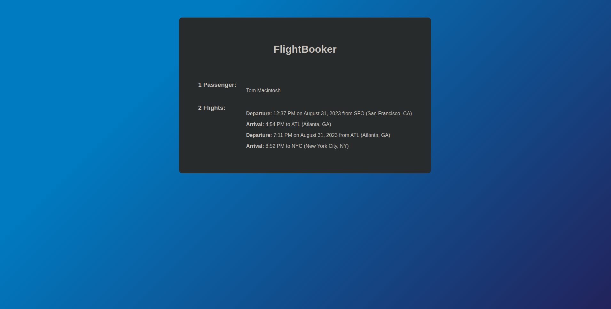

# FlightBooker

## Live Project

You can try it out [here](https://ramsey-flight-booker-11a9821118cb.herokuapp.com/) via Heroku.

## Screenshots

  
  
  

## About

FlightBooker was created based on The Odin Project's advanced forms project for building a [Flight-Booker](https://www.theodinproject.com/lessons/ruby-on-rails-flight-booker). This project is a fairly simple and straighforward where a user books a 1-way flight. The main focus was getting more comfortable with Active Record and more advanced forms. In addition, I learned how to seed a database, set up and send a mailer, how to use service objects, and how to implement hidden fields within forms. Overall, it was good experience dealing with more complex associations.

## Features 

- User Searches Flights

  - users find flights based on the origin airport, destination airport, and the departure date. This feature required associations between the airports and flights, seeding the database, and building a form using pre-populated dropdowns.

- User Pick A Flight

  - on the same page as the search, users select the flight that they would like to book. This feature required working with parameters and using a hidden field for the number of passengers.

- User Enters Passenger Information 

  - users enter passenger information to finalize their booking. This feature required `Bookings` to accept nested attributes for `Passengers`. 

- 2 Connecting Flights 

  - created a service object, `BookingOptions`, to find the available flights. If a direct flight is less then 4 hours long, it will only return direct flights. However, if a direct flight is over 4 hours long, it will add a layover and continue looking for connecting flights.

- Styling

  - vanilla CSS
  - added responsiveness using a combination of media queries and flexbox. 
